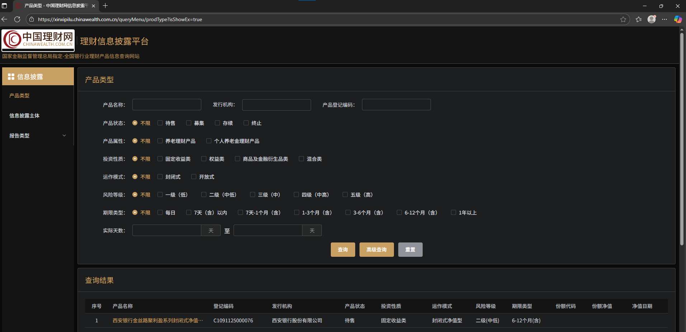
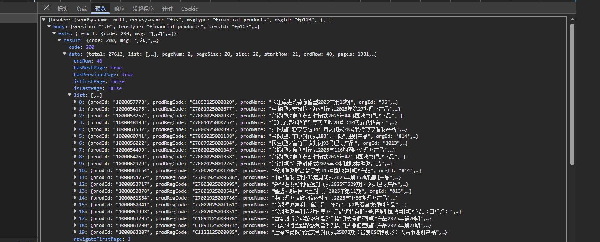
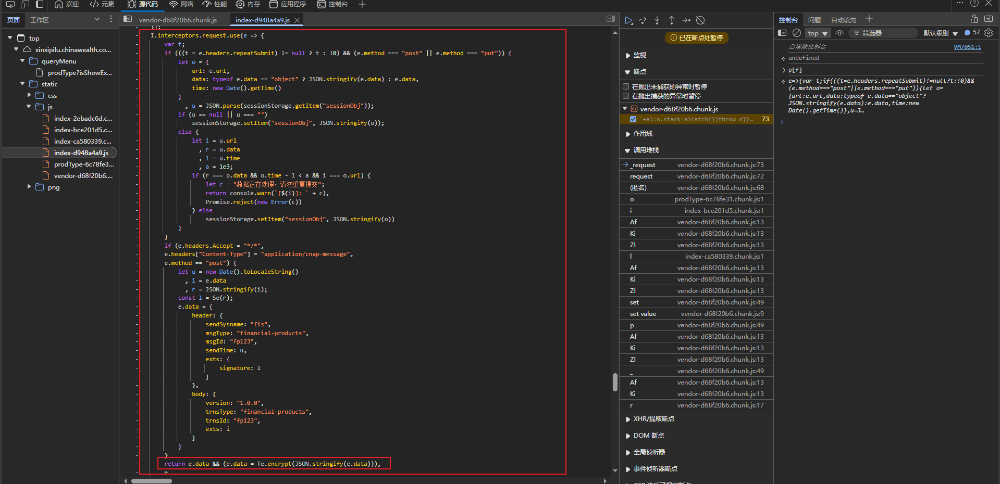
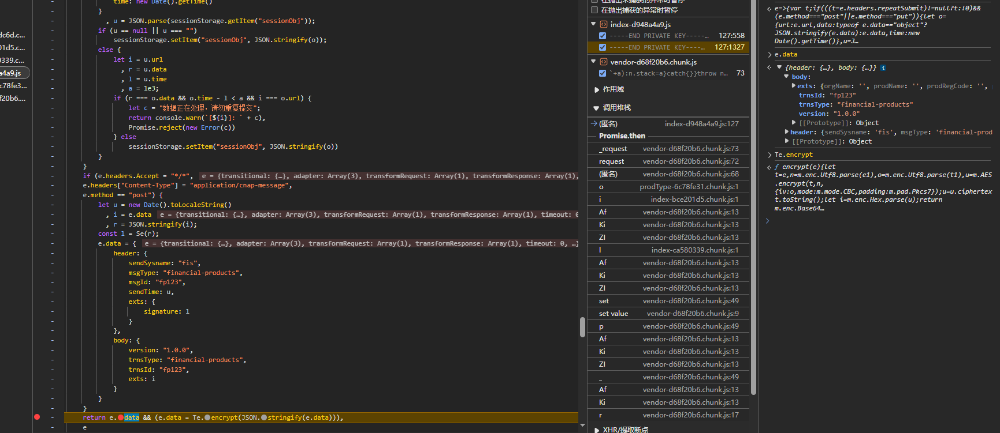
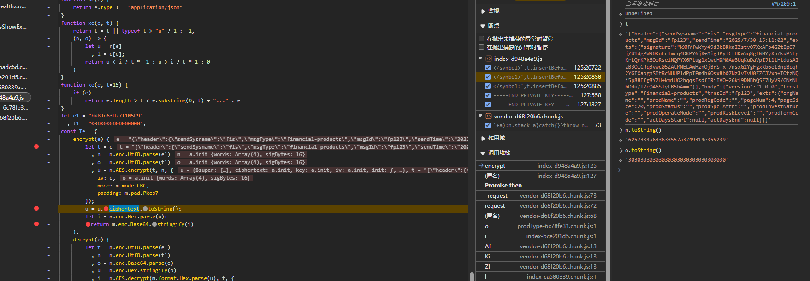
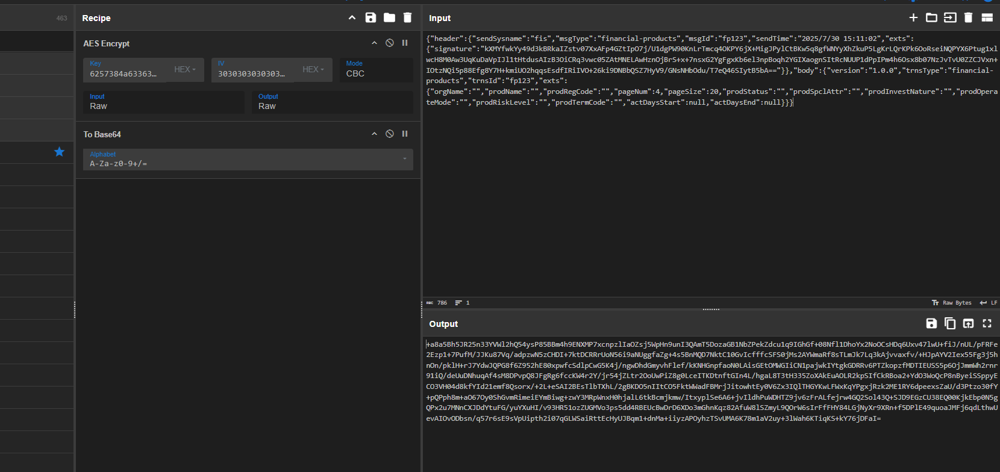
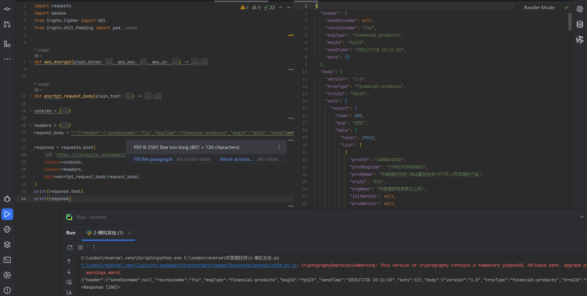

[中国理财网信息披露平台](https://xinxipilu.chinawealth.com.cn/queryMenu/prodType?isShowEx=true) https://xinxipilu.chinawealth.com.cn/queryMenu/prodType?isShowEx=true

点击翻页，然后XHR就一个

请求头没东西

请求体加密了

响应没加密，正常的

接下来就看请求体加密就行；

开始跟栈

一个个跟

这个地方还是加密的状态，继续跟一个

打印e.data发现还是加密的

还是加密的，我们继续

这里是异步的，问ai加上查资料说是如果成功走then的第一个参数对应的函数，失败则是第二个

所以我们打印p[f]就行，然后

打上断点，接着去控制台输入 `p[f]`；接着双击跳转

在这里面打上断点，然后依次单步寻找加密的位置；其实一眼能看到是最后有一个 e.data 赋值；而且还有encrypt

接着控制台输入Te.encrypt然后跳过去

关注这个encrypt就行

这是个aes加密

去控制台把需要的数据都拿出来，明文，key，iv

然后去加密网站测试

断点到加密好的地方，然后对比一下，发现没啥问题；

写一下python代码

接下去赋值curl(bash)然后转python代码

然后组合一下代码，就行了

搞定！

